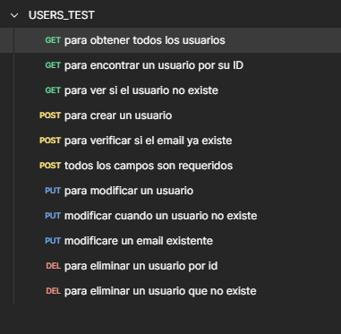

<p align="center">
  <a href="http://nestjs.com/" target="blank"></a>
</p>

[circleci-image]: https://img.shields.io/circleci/build/github/nestjs/nest/master?token=abc123def456
[circleci-url]: https://circleci.com/gh/nestjs/nest

  <p align="center">A progressive <a href="http://nodejs.org" target="_blank">Node.js</a> framework for building efficient and scalable server-side applications.</p>
    <p align="center">
<a href="https://www.npmjs.com/~nestjscore" target="_blank"></a>
<a href="https://www.npmjs.com/~nestjscore" target="_blank"></a>
<a href="https://www.npmjs.com/~nestjscore" target="_blank"></a>
<a href="https://circleci.com/gh/nestjs/nest" target="_blank"></a>
<a href="https://coveralls.io/github/nestjs/nest?branch=master" target="_blank"></a>
<a href="https://discord.gg/G7Qnnhy" target="_blank"></a>
<a href="https://opencollective.com/nest#backer" target="_blank"></a>
<a href="https://opencollective.com/nest#sponsor" target="_blank"></a>
  <a href="https://paypal.me/kamilmysliwiec" target="_blank"></a>
    <a href="https://opencollective.com/nest#sponsor"  target="_blank"></a>
  <a href="https://twitter.com/nestframework" target="_blank"></a>
</p>
  <!--[](https://opencollective.com/nest#backer)
  [](https://opencollective.com/nest#sponsor)-->

## Description

[Nest](https://github.com/nestjs/nest) framework TypeScript starter repository.

## Project setup

```bash
$ npm install
```

## Compile and run the project

```bash
# development
$ npm run start

# watch mode
$ npm run start:dev

# production mode
$ npm run start:prod
```

## Run tests

```bash
# unit tests
$ npm run test

# e2e tests
$ npm run test:e2e

# test coverage
$ npm run test:cov
```

## Resources

Check out a few resources that may come in handy when working with NestJS:

- Visit the [NestJS Documentation](https://docs.nestjs.com) to learn more about the framework.
- For questions and support, please visit our [Discord channel](https://discord.gg/G7Qnnhy).
- To dive deeper and get more hands-on experience, check out our official video [courses](https://courses.nestjs.com/).
- Visualize your application graph and interact with the NestJS application in real-time using [NestJS Devtools](https://devtools.nestjs.com).
- Need help with your project (part-time to full-time)? Check out our official [enterprise support](https://enterprise.nestjs.com).
- To stay in the loop and get updates, follow us on [X](https://x.com/nestframework) and [LinkedIn](https://linkedin.com/company/nestjs).
- Looking for a job, or have a job to offer? Check out our official [Jobs board](https://jobs.nestjs.com).

## Support

Nest is an MIT-licensed open source project. It can grow thanks to the sponsors and support by the amazing backers. If you'd like to join them, please [read more here](https://docs.nestjs.com/support).

## Stay in touch

- Author - [Kamil Myśliwiec](https://twitter.com/kammysliwiec)
- Website - [https://nestjs.com](https://nestjs.com/)
- Twitter - [@nestframework](https://twitter.com/nestframework)

## License

Nest is [MIT licensed](https://github.com/nestjs/nest/blob/master/LICENSE).

## Documentacion


## METODO GET

## Para obtener todos los usuarios
```javascript
pm.test("el codigo deberia ser 200", function () {
     pm.expect(pm.response.code).to.equal(200);
});

pm.test("el tiempo de requests debe ser menor a 500 ms", function () {
    pm.expect(pm.response.responseTime).to.be.below(500);
});

pm.test("la respuesta deberia tener los campos de id, name,email",function(){
    const jsonData = pm.response.json();
    jsonData.forEach(item => {
        pm.expect(item).to.have.property("id");
        pm.expect(item).to.have.property("name");
        pm.expect(item).to.have.property("email");
    })
}); 

pm.test("el campo 'id' debe ser un numero", function () {
    const jsonData = pm.response.json();
    jsonData.forEach(item =>{
        pm.expect(item.id).to.be.a("number");
    })

});

pm.test("el campo 'nombre','email' debe ser cadena", function () {
    const jsonData = pm.response.json();
    jsonData.forEach(item =>{
        pm.expect(item.name).to.be.a("string");
        pm.expect(item.email).to.be.a("string");
    })

});

pm.test("la respuesta debe ser en formato json",function () {
    pm.response.to.be.json;
})
```
## Para obtener un usuario por ID
```javascript

pm.test("el codigo del requests debe ser 200", function () {
    pm.expect(pm.response.code).to.equal(200);
})

pm.test("el formato de respuesta debe ser en formato json", function () {
    pm.response.to.be.json;
});

pm.test("el response debe ser menor a 500 ms", function () {
    pm.expect(pm.response.responseTime).to.be.below(500);
});

pm.test("la respuesta deberia tener los campos de id,name,email", function () {
    const jsonData = pm.response.json();
    pm.expect(jsonData).to.have.property("id");
    pm.expect(jsonData).to.have.property("name");
    pm.expect(jsonData).to.have.property("email");
});

pm.test("el campo 'id' deberia ser un numero", function () {
    const jsonData = pm.response.json();
    pm.expect(jsonData).to.have.property("id").that.is.a("number")

});
pm.test("el campo 'name', 'email ' deberia ser cadena", function () {
    const jsonData = pm.response.json();
    pm.expect(jsonData).to.have.property("name").that.is.a("string")
    pm.expect(jsonData).to.have.property("email").that.is.a("string")
});
pm.test("el formato debe de ser un objeto ",function(){
    const jsonData = pm.response.json();
    pm.expect(jsonData).to.be.an("object");
});
```
## Para ver si el usuario no existe
```javascript
pm.test("el formato debe ser json",function(){
    pm.response.to.be.json;
});

pm.test("la respuesta es menor a 500 ms", function(){
    pm.expect(pm.response.responseTime).to.be.below(500)
});

pm.test("el formato debe de ser un objeto ",function(){
    const jsonData = pm.response.json();
    pm.expect(jsonData).to.be.an("object");
});
pm.test("el codigo debe ser 200",function(){
    pm.expect(pm.response.code).to.equal(404)
});

pm.test("el mensaje debe ser User not found", function () {
    var jsonData = pm.response.json();
    pm.expect(jsonData.message).to.equal("User Not Found");
});
```

## METODO POST
## Para crear un usuario 
```javascript
pm.test("el codigo de la respuesta debe ser 201", function(){
    pm.expect(pm.response.code).to.equal(201)
}) 
pm.test("la respuesta debe ser menro a 500 ms", function () {
    pm.expect(pm.response.responseTime).to.be.below(500);
});

pm.test("el formato de respuesta debe ser en formato JSON", function () {
    pm.response.to.be.json;
});

pm.test("la respuesta deberia tener los campos de id,name,email", function () {
    const jsonData = pm.response.json();
    pm.expect(jsonData).to.have.property("id");
    pm.expect(jsonData).to.have.property("name");
    pm.expect(jsonData).to.have.property("email");
});

pm.test("el campo 'id' deberia ser un numero", function () {
    const jsonData = pm.response.json();
    pm.expect(jsonData).to.have.property("id").that.is.a("number")

});
pm.test("el campo 'name', 'email ' deberia ser cadena", function () {
    const jsonData = pm.response.json();
    pm.expect(jsonData).to.have.property("name").that.is.a("string")
    pm.expect(jsonData).to.have.property("email").that.is.a("string")
});
pm.test("el formato debe de ser un objeto ",function(){
    const jsonData = pm.response.json();
    pm.expect(jsonData).to.be.an("object");
});

```
## Para verificar si el email ya existe
```javascript
pm.test("la respuesta de codigo debe ser 400", function () {
    pm.expect(pm.response.code).to.equal(400);
});

pm.test("el timepo de respuesta deber ser menor a 500 ms", function () {
    pm.expect(pm.response.responseTime).to.be.below(500)
});

pm.test("el formato de respuesta debe ser json", function () {
     pm.response.to.be.json;
});

pm.test("el mensaje de respuesta debe ser Email already exists",function() {
    const jsonData = pm.response.json();
    pm.expect(jsonData).to.have.property('message','Email already exists');
})

pm.test("verifica que los tipos de datos en el error sean correctos", function() {
    const jsonData = pm.response.json();
    pm.expect(jsonData.message).to.be.a('string');
    pm.expect(jsonData.error).to.be.a("string");
    pm.expect(jsonData.statusCode).to.be.a("number");
});
pm.test("el formato debe de ser un objeto ",function(){
    const jsonData = pm.response.json();
    pm.expect(jsonData).to.be.an("object");
});

```
## Para que todos los campos sean requeridos
```javascript
pm.test("la respuesta de codigo debe ser 400", function () {
    pm.expect(pm.response.code).to.equal(400);
});

pm.test("el timepo de respuesta deber ser menor a 500 ms", function () {
    pm.expect(pm.response.responseTime).to.be.below(500)
});

pm.test("el formato de respuesta debe ser json", function () {
     pm.response.to.be.json;
});

pm.test("manda el mensje de que los todos los campos son requeridos",function() {
    const jsonData = pm.response.json();
    pm.expect(jsonData.message).to.include("the password is required");
    pm.expect(jsonData.message).to.include("password must be a string");
})

pm.test("el formato debe de ser un objeto ",function(){
    const jsonData = pm.response.json();
    pm.expect(jsonData).to.be.an("object");
});
```
## PARA EL METODO PUT
## Para modificar un usuario
```javascript
pm.test("el codigo debe ser 200",function(){
    pm.expect(pm.response.code).to.equal(200)
});

pm.test("la respuesta es menor a 500 ms", function(){
    pm.expect(pm.response.responseTime).to.be.below(500)
});

pm.test("el formato debe ser json",function(){
    pm.response.to.be.json;
});

pm.test("la respuesta debe mandar los campos de 'id','name','email'",function(){
    const jsonData = pm.response.json();
    pm.expect(jsonData).to.have.property("id");
    pm.expect(jsonData).to.have.property("name");
    pm.expect(jsonData).to.have.property("email");
});

pm.test("el tipo de datos de 'id' debe ser number",function () {
    const jsonData = pm.response.json();
    pm.expect(jsonData).to.have.property("id").that.is.a("number");
});


pm.test("el tipo de dato de 'name','email' debe ser string",function() {
    const jsonData = pm.response.json();
    pm.expect(jsonData).to.have.property("name").that.is.a("string");
    pm.expect(jsonData).to.have.property("email").that.is.a("string");
});

pm.test("el formato debe de ser un objeto ",function(){
    const jsonData = pm.response.json();
    pm.expect(jsonData).to.be.an("object");
});
```
## Para modificar un usuario que no existe
```javascript
pm.test("el codigo debe ser 200",function(){
    pm.expect(pm.response.code).to.equal(404)
});

pm.test("la respuesta es menor a 500 ms", function(){
    pm.expect(pm.response.responseTime).to.be.below(500)
});

pm.test("el formato debe ser json",function(){
    pm.response.to.be.json;
});

pm.test("el formato debe de ser un objeto ",function(){
    const jsonData = pm.response.json();
    pm.expect(jsonData).to.be.an("object");
});

pm.test("el mensaje debe ser User not found", function () {
    var jsonData = pm.response.json();
    pm.expect(jsonData.message).to.equal("User not found");
});

```
## Para modificar un email ya existente
```javascript
pm.test("el codigo debe ser 200",function(){
    pm.expect(pm.response.code).to.equal(400)
});

pm.test("la respuesta es menor a 500 ms", function(){
    pm.expect(pm.response.responseTime).to.be.below(500)
});

pm.test("el formato debe ser json",function(){
    pm.response.to.be.json;
});

pm.test("el formato debe de ser un objeto ",function(){
    const jsonData = pm.response.json();
    pm.expect(jsonData).to.be.an("object");
});

pm.test("el mensaje debe ser User not found", function () {
    var jsonData = pm.response.json();
    pm.expect(jsonData.message).to.equal("Email already exists");
});

```
## PARA EL METODO DELETE

## Para borrar un usuario
```javascript
pm.test("el codigo debe ser 200",function(){
    pm.expect(pm.response.code).to.equal(200)
});

pm.test("la respuesta es menor a 500 ms", function(){
    pm.expect(pm.response.responseTime).to.be.below(200)
});

pm.test("el formato debe ser json",function(){
    pm.response.to.be.json;
});

pm.test("el formato debe de ser un objeto ",function(){
    const jsonData = pm.response.json();
    pm.expect(jsonData).to.be.an("object");
});

pm.test("el mensaje que debe mandaar es User deleted successfully",function(){
    const jsonData = pm.response.json();
    pm.expect(jsonData.message).to.equal("User deleted successfully");
})

pm.test("la respuesta debe tener un campo de mensaje",function(){
    const jsonData = pm.response.json();
    pm.expect(jsonData).to.have.property("message");
});

pm.test("el tipo de mensaje debe ser cadena",function(){
    const jsonData = pm.response.json();
    pm.expect(jsonData).to.have.property("message").that.is.a("string");
});

```
## Para borrar un usuario que no existe
```javascript
  pm.test("el codigo debe ser 200",function(){
    pm.expect(pm.response.code).to.equal(404)
});

pm.test("la respuesta es menor a 500 ms", function(){
    pm.expect(pm.response.responseTime).to.be.below(200)
});

pm.test("el formato debe ser json",function(){
    pm.response.to.be.json;
});

pm.test("el formato debe de ser un objeto ",function(){
    const jsonData = pm.response.json();
    pm.expect(jsonData).to.be.an("object");
});

pm.test("el mensaje que debe mandaar es User deleted successfully",function(){
    const jsonData = pm.response.json();
    pm.expect(jsonData.message).to.equal("User not found");
})

pm.test("la respuesta debe tener un campo de mensaje",function(){
    const jsonData = pm.response.json();
    pm.expect(jsonData).to.have.property("message");
});

pm.test("el tipo de mensaje debe ser cadena",function(){
    const jsonData = pm.response.json();
    pm.expect(jsonData).to.have.property("message").that.is.a("string");
});

```